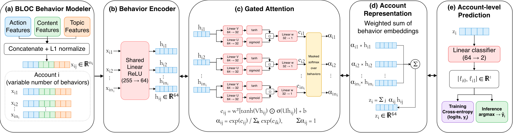
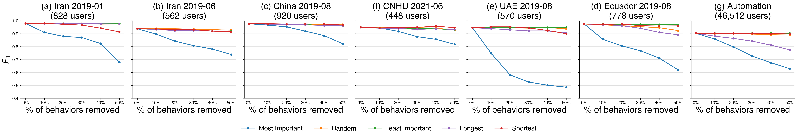

# SMAT

We developed SMAT, a gated-attention multiple-instance learning framework that
detects automated and coordinated social-media accounts from BLOC behavioral
features. Figure 1 shows how SMAT encodes, weights, and aggregates behavior
features for account-level prediction. SMAT also identifies the behaviors that
contribute most to each prediction; Figure 2 shows that removing these highly
ranked behaviors produces the greatest decline in detection performance.



**Figure 1: Overview of SMAT.** SMAT encodes BLOC action, content, and topic
features into behavior representations, weights them with gated attention, and
pools them for account-level classification using only account-level labels.



**Figure 2: Behavior-removal ablation.** Removing the behaviors that SMAT ranks
as most important causes the largest macro-$F_1$ degradation across automation
and coordination detection tasks.

## Datasets

We evaluated SMAT in two account-level classification settings. For automation
detection, we combined multiple bot and human account collections into one
experiment. For coordination detection, we evaluated six information-operation
campaigns independently: two from Iran and one each from China, the UAE,
Ecuador, and CNHU. Each JSON file represents one account and contains its class
label and tweet history. We converted the tweets into variable-length BLOC
behavior segments, removed accounts with fewer than 10 segments and duplicate
users, and balanced the remaining classes for each experiment.

Run the complete analysis from one Python entry point. Run all commands from
the project root.

## Setup

```bash
python3 -m venv .venv
source .venv/bin/activate
python -m pip install -r requirements.txt
```

## Source layout

We organize the implementation by responsibility:

```text
src/
├── config.py       # Dataset schema and experiment constants
├── features.py     # BLOC segmentation and unigram/bigram features
├── bags.py         # Variable-length MIL bags and batch collation
├── model.py        # Gated-attention network, restoration, and inference
├── datasets.py     # Dataset discovery, filtering, balancing, and saving
├── training.py     # Cross-validation and model training
├── ablation.py     # Frozen-model segment ablations
├── export_segment_rankings.py # Export ranked tweet-ID segments
└── utils.py        # Generic I/O, device, seeding, and path helpers
```

## Input data

Place one JSON file per user inside each dataset or campaign directory:

```text
automation_data/
├── dataset1/
│   ├── user1.json
│   └── user2.json
└── dataset2/
    ├── user3.json
    └── user4.json

coordination_data/
├── campaign1/
│   ├── user1.json
│   └── user2.json
└── campaign2/
    ├── user3.json
    └── user4.json
```

Each user JSON file should follow this structure. The keys inside
`tweet_details` are string indexes (`"0"`, `"1"`, and so on), with one object
per tweet:

```json
{
  "user_id": "123456789",
  "user_class": "bot",
  "tweet_details": {
    "0": {
      "action": "r",
      "content_syntactic": "(qt)",
      "change": "",
      "topics": "politics",
      "topic_symbol": "P",
      "entities": ["Example Entity"],
      "entity_symbols": ["⊛"],
      "sentiments": "-",
      "text": "Example tweet text",
      "exclusive_text": "Example tweet text",
      "created_at": "Fri Aug 07 14:42:54 +0000 2020",
      "tweet_id": "1291746646938853377"
    }
  }
}
```

Coordination data may also have a `YYYY_MM` grouping level above the campaign
directories. The pipeline treats month folders as containers and processes
each child campaign as an independent experiment. Campaign directories
containing `YYYY` in their name may contain matching year-specific partitions
(for example, `CNHU_0621_YYYY/CNHU_0621_2020` and `CNHU_0621_2021`); the
pipeline combines those partitions into one experiment. You can also supply a
single campaign directory directly.

Automation combines all dataset directories into one experiment. Coordination
processes every campaign as an independent experiment. The pipeline reads class
names from each user's `user_class` field instead of hard-coding them.

## Run the complete pipeline

Automation detection on the main dataset:
              
```bash
python3 pipeline.py automation main automation_dataset
```

Coordination detection on the infoOps dataset:


```bash
python3 pipeline.py coordination infoOps coordination_dataset    
```

Each command runs the entire workflow:

1. Creates the task-specific dataset.
2. Keeps users with at least 10 segments, removes duplicate users, and then
   balances the dynamically discovered classes.
3. Fits and saves one fixed action/content/topic character unigram/bigram vocabulary
   for each prepared experiment.
4. Trains and saves five fold-specific MIL models for 25 epochs with batch size
   64. All folds use the experiment's saved vocabulary.
5. Runs the frozen-model ablation study and combines the fold-wise results into
   CSV files.

## Results

The pipeline keeps results from different tasks and datasets separate:

```text
results/
├── datasets/<task>/<dataset>/
│   └── <experiment>/
│       ├── users.csv
│       └── vocabularies.json
├── mil/<task>/<dataset>/<experiment>/
│   ├── models/fold_1.pt ... fold_5.pt
│   └── predictions.csv
└── ablation/<task>/<dataset>/<experiment>/
    └── predictions/*.csv
```

Each ablation CSV contains the combined out-of-fold user predictions for one
removal method and percentage. Most-important and Least-important removal select the
highest and lowest baseline attention weights, respectively. Longest and
shortest removal rank segments by their number of BLOC action symbols; pause
symbols do not contribute to this count.

## Export segment rankings

Export each user's tweet-ID segments in descending MIL-attention order:

```bash
python -m src.export_segment_rankings
```

By default, the script reads every `predictions.csv` below `results/mil` and
writes one CSV per experiment to `segment_ranking_radataset`. Each output row
contains `user_id`, `dataset`, `user_class`, and a JSON-encoded `tweet_ranks`
list. Every ranked segment includes its rank, attention weight, and tweet IDs.

## Labeled dataset

We used SMAT to create a labeled dataset of 3,954,776 potentially abusive
social-media posts from 25,309 inauthentic bot and coordinated accounts. While
the source datasets identify whether an entire account is inauthentic, SMAT's
attention mechanism provides a finer-grained signal by ranking the account's
behavior segments according to their importance to the model's prediction.

The dataset retains the account ID, source dataset or campaign, and account
class. For each account, `tweet_ranks` records every behavior's rank, attention
weight, and associated tweet IDs; a behavior can contain one or more posts.
This structure connects the original account-level label to the individual
posts that most strongly characterize the detected inauthentic behavior.

These behavior-level importance labels are valuable because posts from the
same inauthentic account are not equally informative, and manually annotating
millions of posts would be expensive and subjective. The dataset enables more
detailed analysis of the actions, content, and topics associated with
inauthentic activity and can support research on explanation, moderation,
campaign comparison, and the development of finer-grained detection methods.
